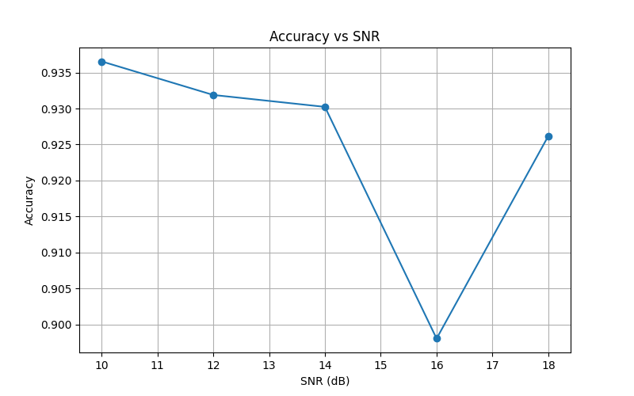

# 📡 Automatic Modulation Classification based on Deep Learning

## 🚀 项目简介

本项目基于深度学习方法，实现了对无线通信信号的**自动调制识别（Automatic Modulation Classification, AMC）**。

利用公开数据集 **RadioML 2016.10A**，构建 CNN 模型，对不同调制方式（如 BPSK、QPSK、8PSK、QAM16）进行分类，并分析模型在不同信噪比（SNR）条件下的性能表现。

---

## 📊 项目亮点

* ✅ 使用真实通信数据（RadioML 数据集）
* ✅ 实现端到端信号分类（IQ信号 → 调制类型）
* ✅ 加入信号归一化，提高模型训练稳定性
* ✅ 支持按 SNR 分析模型性能
* ✅ 可视化训练曲线、混淆矩阵、SNR性能曲线

---

## 🧠 方法概述

### 输入数据

* 复基带 IQ 信号
* 每个样本维度：`(2, 128)`

### 模型结构

* 基于卷积神经网络（CNN）
* 提取时序信号特征
* 输出调制类别

### 任务设置

* 调制类型：BPSK, QPSK, 8PSK, QAM16
* SNR范围：10 ~ 18 dB

---

## 📈 实验结果

### 🎯 分类准确率

* 验证集准确率：**91.56%**

---

### 📉 训练过程


---

### 🔍 混淆矩阵


---

### 📡 不同 SNR 下性能



---

## 📁 项目结构

```text
signal-modulation-classification/
├── data/                      # 数据集
├── models/
│   └── cnn_model.py          # CNN模型
├── dataset.py                # 数据加载与预处理
├── train.py                  # 训练脚本
├── test.py                   # 测试与混淆矩阵
├── evaluate_by_snr.py        # SNR性能分析
├── results/                  # 结果图与模型
│   ├── loss_curve.png
│   ├── accuracy_curve.png
│   ├── confusion_matrix.png
│   ├── accuracy_vs_snr.png
│   ├── best_cnn_model.pth
│   └── last_cnn_model.pth
└── README.md
```

---

## ⚙️ 使用方法

### 1️⃣ 安装依赖

```bash
pip install torch numpy matplotlib scikit-learn
```

---

### 2️⃣ 训练模型

```bash
python train.py
```

---

### 3️⃣ 测试模型

```bash
python test.py
```

---

### 4️⃣ 按 SNR 评估

```bash
python evaluate_by_snr.py
```

---

## 📚 数据集

* RadioML 2016.10A
* 包含多种调制方式与不同信噪比条件下的信号样本

---

## 🧩 后续改进方向

* 引入更多调制类型（如 QAM64、AM、FM）
* 扩展到全 SNR 范围（-20 ~ 18 dB）
* 尝试更复杂模型（ResNet / LSTM / Transformer）
* 引入数据增强与噪声建模
* 研究低信噪比下的鲁棒性

---

## 👨‍💻 作者

* 本项目由个人独立完成，用于通信信号处理与深度学习方向的实践与研究。
> 本项目结合通信原理与深度学习方法，体现了信号处理与人工智能的交叉应用能力。