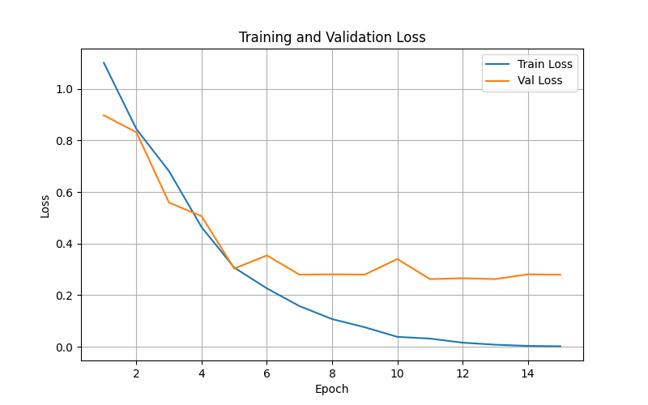
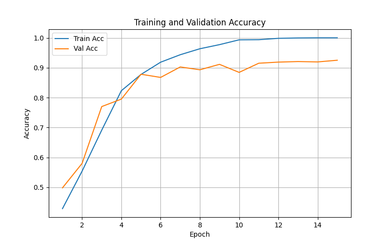
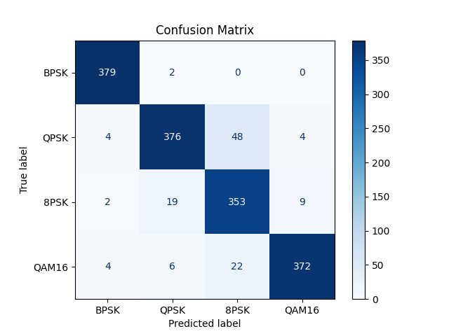

# 📡 面向跨信噪比分布泛化的无线信号自动调制识别研究
## Automatic Modulation Classification under Cross-SNR Generalization


> 本项目不是一个只追求“高精度”的普通分类项目，而是一个围绕 **Cross-SNR Generalization（跨信噪比分布泛化）** 展开的研究型项目。  
> 项目从基础 CNN baseline 出发，经历了：
>
> - 异常高精度结果排查
> - 数据抽样方式修正
> - 极小样本过拟合测试
> - 功率归一化修复
> - 跨 SNR 泛化实验
> - 噪声增强、ResNet1D、Transformer 对比
> - 多次重复实验统计
>
> 最终将问题收束到一个更本质的结论：  
> **AMC 在低信噪比场景下的核心难点，不在于模型复杂度不足，而在于鲁棒表征学习不足。**

---

## ✨ 项目亮点速览

- 🔍 **问题导向**：关注高 SNR 训练、低 SNR 测试下的泛化能力
- 🧪 **过程完整**：从 baseline 到异常排查、归一化修复、改进对比
- 📉 **现象明确**：同分布高精度，但跨 SNR 条件下性能明显下降
- ⚖️ **结论扎实**：通过多次重复实验报告均值和标准差
- 🧠 **科学思维清晰**：逐步证明问题关键在鲁棒表征学习，而不是模型复杂度

# 目录

## Part I. 项目速览
- [项目简介](#项目简介)
- [核心问题](#核心问题)
- [主要结论](#主要结论)
- [关键结果表](#关键结果表)
- [关键图表](#关键图表)
- [快速运行](#快速运行)

## Part II. 完整研究过程
- [为什么这个问题值得研究](#为什么这个问题值得研究)
- [整体研究路线](#整体研究路线)
- [从异常高精度开始第一次关键转折](#从异常高精度开始第一次关键转折)
- [数据抽样修正](#数据抽样修正)
- [极小样本过拟合测试](#极小样本过拟合测试)
- [功率归一化真正打通训练链路](#功率归一化真正打通训练链路)
- [baseline 构建](#baseline-构建)
- [跨 SNR 泛化实验](#跨-snr-泛化实验)
- [一步步改进与对比](#一步步改进与对比)
- [多次重复实验最终可信结论](#多次重复实验最终可信结论)

## Part III. 工程结构与复现
- [项目结构](#项目结构)
- [每个模块详细说明](#每个模块详细说明)
- [复现顺序建议](#复现顺序建议)

## Part IV. 总结与扩展
- [这个项目真正体现了什么能力](#这个项目真正体现了什么能力)
- [局限性](#局限性)
- [未来工作](#未来工作)
- [简历面试可用表述](#简历面试可用表述)

---
---

# Part I. 项目速览

## 项目简介

本项目研究的是 **无线信号自动调制识别（AMC）** 问题。

简单来说，就是给模型一段接收到的复基带 IQ 信号，让它判断该信号属于哪种调制方式。本项目聚焦 4 种数字调制：

- `BPSK`
- `QPSK`
- `8PSK`
- `QAM16`

但本项目真正的重点不是“做一个分类器”，而是研究一个更贴近真实通信场景的问题：

> **如果模型只在高信噪比（高 SNR）样本上训练，它能不能泛化到低信噪比（低 SNR）测试环境？**

这就是：

# **Cross-SNR Generalization**

---

## 核心问题

本项目围绕下面 4 个问题展开：

| 问题 | 内容 |
|---|---|
| Q1 | 模型在训练/测试 SNR 分布一致时能否取得较高精度？ |
| Q2 | 若训练只看高 SNR、测试改成低 SNR，性能会不会明显下降？ |
| Q3 | 如果会下降，那么真正原因是什么？ |
| Q4 | 更复杂模型、扩大训练 SNR 范围、噪声增强这些常见改进方式到底有没有帮助？ |

---

## 主要结论

### 结论一：同分布高精度不代表真实泛化强
在高 SNR 同分布条件下，CNN 可达到：

- **Test Accuracy = 0.9287**

但这不代表模型真的具备强泛化能力，因为一旦测试分布切换到低 SNR，性能会显著下降。

---

### 结论二：跨 SNR 条件下性能明显退化
在“高 SNR 训练 → 低 SNR 测试”场景下，CNN baseline 平均准确率只有：

- **0.4302 ± 0.0282**

说明该任务的关键问题不是普通分类，而是：

# **分布偏移（Distribution Shift）**

---

### 结论三：更复杂模型不一定更好
在多次重复实验中：

- ResNet1D 低于 CNN baseline
- Transformer 最差

说明：

> **模型变复杂 ≠ 泛化更强**

---

### 结论四：简单噪声增强未提升均值，但降低了波动
噪声增强最终结果为：

- **0.4263 ± 0.0146**

平均值略低于 baseline，但标准差更小。  
这说明噪声增强更像是在降低训练波动，而不是稳定提高性能上限。

---

## 关键结果表

### 同分布结果

| 设置 | Test Accuracy |
|---|---:|
| CNN, Same Distribution | **0.9287** |

### 跨 SNR 多次重复实验结果（3 runs）

| 方法 | 平均准确率 | 标准差 | 结论 |
|---|---:|---:|---|
| CNN baseline | **0.4302** | **0.0282** | 当前最强平均 baseline |
| Noise Augmentation | 0.4263 | 0.0146 | 未提升均值，但更稳定 |
| ResNet1D | 0.3869 | 0.0287 | 更复杂卷积结构无优势 |
| Transformer | 0.2504 | 0.0025 | 全局建模在本任务下表现最差 |

---

## 关键图表

### 最终总对比图


### 训练过程图




### 混淆矩阵


---
## 快速运行

### 安装依赖

```bash
pip install torch numpy matplotlib scikit-learn
```

### 准备数据

```text
data/RML2016.10a_dict.pkl
```

### 推荐运行命令

```bash
python inspect_data.py
python train.py
python test.py
python evaluate_by_snr.py
python snr_generalization.py
python snr_augmentation_experiment.py
python resnet_snr_experiment.py
python transformer_snr_experiment.py
python multi_run_comparison.py
python plot_final_comparison.py
```

---
# Part II. 完整研究过程


## 为什么这个问题值得研究

自动调制识别在以下场景中都很重要：

- 认知无线电
- 频谱感知
- 智能接收机
- 电子侦察与对抗

但真实通信环境中最难的并不是“在干净信号上做分类”，而是：

- 训练环境和测试环境不一致
- 训练时信号强，测试时信号弱
- 模型容易只适应训练分布，缺乏真实部署能力

因此，本项目从一开始就不满足于“做一个能跑的 CNN”，而是要回答：

> **模型在真实分布变化下还能不能工作？**

---

## 整体研究路线

整个项目的研究路径如下：

```text
搭建 baseline
   ↓
发现异常高精度
   ↓
检查标签分布，定位抽样偏差
   ↓
修正随机抽样
   ↓
模型学不动
   ↓
极小样本过拟合测试
   ↓
加入功率归一化
   ↓
建立可信 baseline
   ↓
升级为跨 SNR 泛化问题
   ↓
比较 wider SNR / noise aug / ResNet / Transformer
   ↓
多次重复实验，输出 mean ± std
   ↓
收束到问题本质：鲁棒表征学习
```

## 从异常高精度开始第一次关键转折

项目最早阶段曾出现：

- 训练准确率接近 100%
- 验证准确率接近 100%

如果这是普通作业，很容易直接写“模型效果很好”。  
但这里没有停下，而是问了一个更重要的问题：

> **为什么会这么高？这个结果靠谱吗？**

于是专门写了 `check_labels.py` 检查标签分布，结果发现：

- 前 10000 条样本全部属于同一类

也就是说，模型并没有学会 AMC，而只是学会了“永远输出同一个类别”。

### 这一阶段最重要的科学思维是：

> **当结果好得不合理时，先怀疑实验设计，而不是先夸模型。**
> 
> 

## 数据抽样修正

原来的抽样方式是：

```
Subset(dataset, range(10000))
```

这会直接取前 10000 条样本，导致类别严重偏置。

修正方式改为全局随机抽样：

```
indices = np.random.choice(len(dataset), size=10000, replace=False)
dataset = Subset(dataset, indices)
```


修正后：

- 精度不再异常完美
- 实验重新回到真实问题难度

# 极小样本过拟合测试

修正抽样后，模型又出现了新问题：
- 训练精度很低
- 验证精度也很低
- 接近随机猜测水平

这时没有立刻换更复杂模型，而是做了一个更基础、更科学的排查：

## 极小样本过拟合测试

即：
- 只抽取 128 条样本
- 看模型能否把这点数据“背下来”

如果连极少量样本都记不住，那么问题通常不是“任务太难”，而是：
- 数据尺度有问题
- 输入预处理有问题
- 训练链路不通

这个阶段通过：
- `overfit_small.py`
- `check_small_labels.py`

来完成。

# 功率归一化真正打通训练链路

进一步分析后发现，原始 IQ 样本在功率尺度上差异较大。
直接输入模型会导致训练非常不稳定。

于是，在 `dataset.py` 中加入对每个样本的功率归一化：
### 功率归一化

公式表达为：

`x ← x / sqrt(E[x²] + ε)`

对应代码思想是对信号功率做归一化，避免样本幅度尺度不一致影响训练。


加入后：
- 极小样本可以成功过拟合
- 说明数据标签没问题
- 模型结构没问题
- 训练链路本身没问题
- 真正关键在输入尺度

## 这一阶段的重要意义
它说明项目不是靠“乱试模型”推进的，而是通过最小实验一步步定位问题根源。  


# baseline 构建

在数据抽样修正 + 输入归一化之后，基础 CNN baseline 才真正建立起来。

相关文件包括：
- `dataset.py`
- `models/cnn_model.py`
- `train.py`
- `test.py`
- `evaluate_by_snr.py`

在高 SNR 同分布条件下，得到：
- **Test Accuracy = 0.9287**

这说明：
- AMC 任务本身是可学的
- 基础 CNN 在理想条件下已经足够强

# 跨 SNR 泛化实验

项目真正进入研究问题阶段，是从这里开始的。

## 实验设置
- Train SNR: `[10, 12, 14, 16, 18]`
- Test SNR: `[-10, -8, -6, -4, -2, 0]`

也就是：
## 高 SNR 训练 → 低 SNR 测试

在这个设定下，CNN baseline 的单次结果降到了：
- 0.4671

按 SNR 细分结果为：

| SNR (dB) | Accuracy |
|----------|----------|
| -10      | 0.2731   |
| -8       | 0.3109   |
| -6       | 0.3677   |
| -4       | 0.4590   |
| -2       | 0.6308   |
| 0        | 0.7700   |

这说明：
- 同分布高精度并不代表真实泛化能力
- SNR越低，模型退化越严重
- 跨分布问题是真实存在的

---

## 一步步改进与对比

### 改进阶段一：扩大训练 SNR 范围

一个很自然的直觉是：
> 如果测试低 SNR 很难，那训练时多见一些 SNR 条件应该会有帮助。

于是进行了 wider SNR training。

结果表明：
- 改善并不明显

这说明：
> 见过更多条件 ≠ 学会了与条件无关的稳定特征
> 

### 改进阶段二：噪声增强训练
在训练阶段给样本加入随机噪声，希望模型更抗噪。

单次实验中，噪声增强有时会比 baseline 更高，但进一步做多次重复实验后，结果为：
- `0.4263 ± 0.0146`

相比 baseline：
- `0.4302 ± 0.0282`

这说明：
- 噪声增强没有带来稳定的平均提升
- 但结果波动更小
- 它更像是在提升训练稳定性，而不是稳定抬升性能上限

---

### 改进阶段三：ResNet1D 对比
引入更复杂的残差卷积结构，希望更强表征能力能改善低 SNR 泛化。

结果：
- `0.3869 ± 0.0287`

低于 CNN baseline。

这说明：
- 更深、更复杂的局部卷积网络并没有改善跨 SNR 泛化
- 模型容量增加不等于泛化更强

### 改进阶段四：Transformer 对比
进一步测试 Signal Transformer，看全局建模是否有帮助。

结果：
- `0.2504 ± 0.0025`

它有两个特点：
1.  最慢
2.  最稳定地差

这说明：
- 它不是偶然失败
- 而是在当前任务设置下稳定地不适合

这也进一步支持一个重要判断：
> AMC 跨 SNR 的核心困难，并不是“长距离依赖没有建模好”，而是低 SNR 条件下的鲁棒特征学习没有解决。
> 
> 
# 多次重复实验最终可信结论

为了让结论更可靠，最终不是只看一次结果，而是用 3 个随机种子重复实验，报告：
- 平均值
- 标准差

最终结果如下：

| 方法                | 平均准确率 | 标准差  |
|---------------------|------------|---------|
| CNN baseline        | 0.4302     | 0.0282  |
| Noise Augmentation  | 0.4263     | 0.0146  |
| ResNet1D            | 0.3869     | 0.0287  |
| Transformer         | 0.2504     | 0.0025  |

## 最终解释
- CNN baseline 仍然是当前最强平均方法
- 噪声增强没有稳定提升均值，但降低了波动
- ResNet 和 Transformer 都没有改善跨 SNR 泛化
- 项目最终将问题收束到：


---
---

# Part III. 工程结构与复现

## 项目结构

```text
signal-modulation-classification/
├── .venv/
├── data/
│   └── RML2016.10a_dict.pkl
├── models/
│   ├── __init__.py
│   ├── cnn_model.py
│   ├── resnet1d.py
│   └── transformer_model.py
├── results/
├── .gitignore
├── check_labels.py
├── check_small_labels.py
├── dataset.py
├── evaluate_by_snr.py
├── inspect_data.py
├── multi_run_cnn_vs_noise.py
├── multi_run_comparison.py
├── overfit_small.py
├── plot_final_comparison.py
├── plot_model_comparison.py
├── README.md
├── resnet_snr_experiment.py
├── snr_augmentation_experiment.py
├── snr_generalization.py
├── test.py
├── train.py
├── transformer_snr_experiment.py
└── utils.py
```

# 每个模块详细说明

 `data/`
存放原始数据集：
- `RML2016.10a_dict.pkl`

---

 `models/cnn_model.py`
基础 CNN baseline。

---

`models/resnet1d.py`
ResNet1D 对比模型。

---

`models/transformer_model.py`
Signal Transformer 对比模型。

---
 `dataset.py`
数据读取与预处理核心模块，负责：
- 筛选调制方式
- 筛选 SNR
- 功率归一化
- 可选噪声增强

---

`inspect_data.py`
最初用来检查数据文件是否能正确读取，理解原始数据结构。

---

`check_labels.py`
用于发现“前 10000 条样本全是一类”的关键脚本。

---

 `check_small_labels.py`
验证极小样本过拟合实验中的标签分布是否均衡。

---

`overfit_small.py`
用于判断模型链路是否真正打通。

`train.py`
基础训练脚本。

---

 `test.py`
基础测试脚本，用于输出分类报告和混淆矩阵。

---

`evaluate_by_snr.py`
按 SNR 分段统计性能。

---

`snr_generalization.py`
完成 same distribution / high-to-low / wider SNR 三组核心实验。

---

`snr_augmentation_experiment.py`
完成噪声增强实验。

---

`resnet_snr_experiment.py`
完成 ResNet1D 跨 SNR 实验。

---
`transformer_snr_experiment.py`
完成 Transformer 跨 SNR 实验。

---

`multi_run_comparison.py`
对 4 种方法做多次重复实验，输出均值和标准差。

---

`multi_run_cnn_vs_noise.py`
只比较 baseline 和噪声增强的快速统计脚本。

---

`plot_final_comparison.py`
绘制最终对比图，适合 README / 报告展示。

---

 `plot_model_comparison.py`
初步模型对比绘图脚本。

---

 `README.md`
项目说明文档，用于展示项目全貌与研究逻辑。

---
`utils.py`
辅助工具文件，为后续扩展预留接口。

# 复现顺序建议
## 路线 A：快速看懂项目
```bash
python inspect_data.py
python train.py
python test.py
python evaluate_by_snr.py
```
## 路线 B：理解研究问题
```bash
python check_labels.py
python overfit_small.py
python snr_generalization.py
python snr_augmentation_experiment.py
python resnet_snr_experiment.py
python transformer_snr_experiment.py
python multi_run_comparison.py
python plot_final_comparison.py
```


---

# Part IV. 总结与扩展

## 这个项目真正体现了什么能力

这个项目最重要的不是“跑了几个模型”，而是它体现了下面这些能力：

### 发现问题
不是看到高精度就结束，而是继续追问“为什么这么高”。

### 质疑结果
主动检查类别分布，发现早期结果其实是伪结果。

### 排查链路
通过极小样本过拟合测试定位归一化问题。

### 做对照实验
每一种改进方式都通过实验验证，而不是只凭感觉。

### 从负结果中提炼结论
这个项目最有价值的结果之一，不是“谁赢了”，而是：
- 哪些直觉方法无效
- 为什么更复杂模型也解决不了问题

### 让结论更可信
最终通过均值和标准差，而不是只看单次结果。

---

## 局限性

当前项目仍然存在一些局限：

- 只覆盖 4 类数字调制
- 低 SNR 条件仍然非常困难
- 数据集复杂度有限
- 增强策略还较简单
- 尚未引入域泛化、自监督等更先进方法

---

## 未来工作

接下来最值得探索的方向包括：

- 域泛化（Domain Generalization）
- 一致性正则
- 对抗式鲁棒训练
- 自监督预训练
- 更真实的通信环境建模（频偏、相位偏移、多径衰落等）

---

## 简历面试可用表述

### 简历版
> 面向跨信噪比分布泛化的无线信号自动调制识别研究：基于 RadioML 2016.10A 数据集构建 AMC 任务，系统比较 CNN、ResNet1D、Transformer 与噪声增强策略在高 SNR 训练—低 SNR 测试场景下的泛化表现。实验表明基础 CNN 平均测试准确率为 43.0%±2.8%，优于 ResNet1D 与 Transformer；噪声增强虽未提升均值，但降低了实验波动，说明 AMC 的核心挑战在于低信噪比条件下的鲁棒表征学习，而非单纯模型复杂度不足。

### 面试版
> 这个项目最重要的发现不是哪个模型分数最高，而是我证明了：在自动调制识别任务中，同分布高精度并不代表真实泛化能力。模型在高 SNR 训练、低 SNR 测试时会显著退化，而更复杂的模型并没有自动解决这个问题。这说明 AMC 的关键难点在于如何学习对信噪比变化更鲁棒的特征，而不是简单堆叠更深的网络。

---

# 结语

这个项目最终没有停留在：

> “我训练了一个 CNN，跑出了一个不错的准确率。”

而是逐步发展成了一个更接近研究训练的问题驱动型项目：

- 从异常结果开始怀疑
- 从最小实验开始排查
- 用对照实验验证直觉
- 用重复实验约束结论
- 最终把问题收束到真正的核心：

**低信噪比条件下的鲁棒表征学习**

如果这个仓库对你有帮助，欢迎 star / fork，也欢迎基于此继续探索更高层次的鲁棒调制识别问题。


